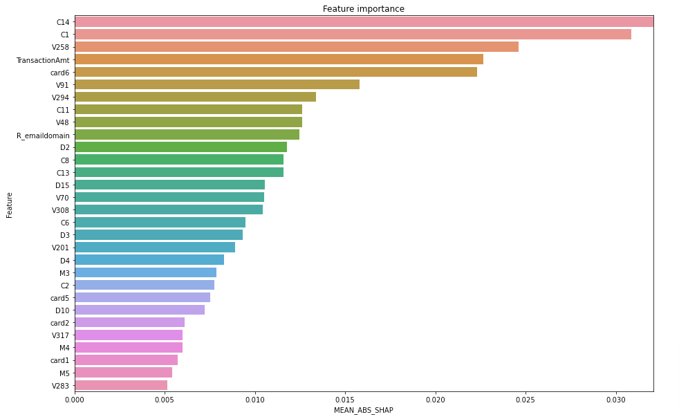

# ieee-fraud-detection

The aim of this repository is to show the methods that I used to train an ensemble model that got nearly 0.91 score on the private board by doing minimal feature engineering. the aim is to keep the code simple and close to the reality. in most Kaggle competitions, competitors will use any means that allows them to rank higher. However in real application you don't do that because of the complexity it brings, risk of less generalization in the future and also the level of abstraction that this overengineered technics can bring.

The Dataset can be download at the competition Page [iee-fraud-detection](https://www.kaggle.com/c/ieee-fraud-detection/data)

## Files

1.  `data-EDA.ipynb` : This file contains the high level EDA used to suggest the minimal feature engineering and data cleaning we used.
2. `data-prep.ipynb` : This file contains the code to clean and feature engineer the dataset. it also include functions to sample stratified and balanced samples.
3. `train-catboost-optimised.ipynb` : This file has code for training using catboost and optimise parameters using Optuna.
4. `train-xgboost-optimised.ipynb` : This file has code for training using xgboost and optimise parameters using Optuna.
5. `train-nn.ipynb` : This file has code for training using fastai tabular model. a fully connected Neural Network. the aim is to compare how the NN does compared to Boosting models.
6. `train-ensemble.ipynb` : This file has final code that train both catboost and xgboost with the best parameters and then ensemnle them in the final submission to Kaggle.